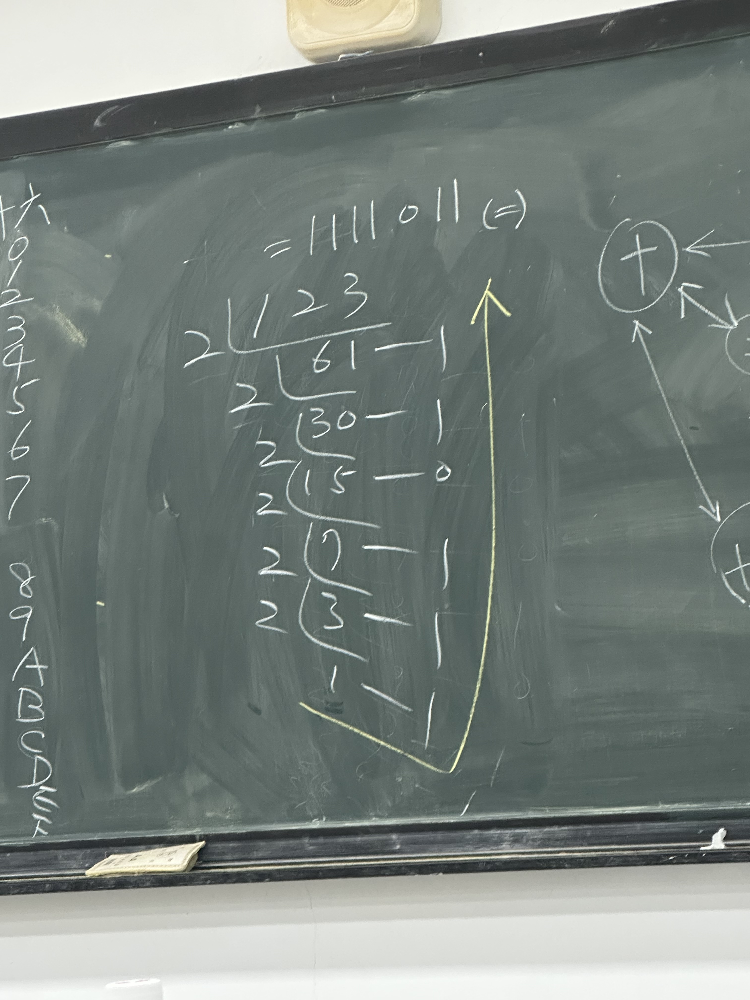
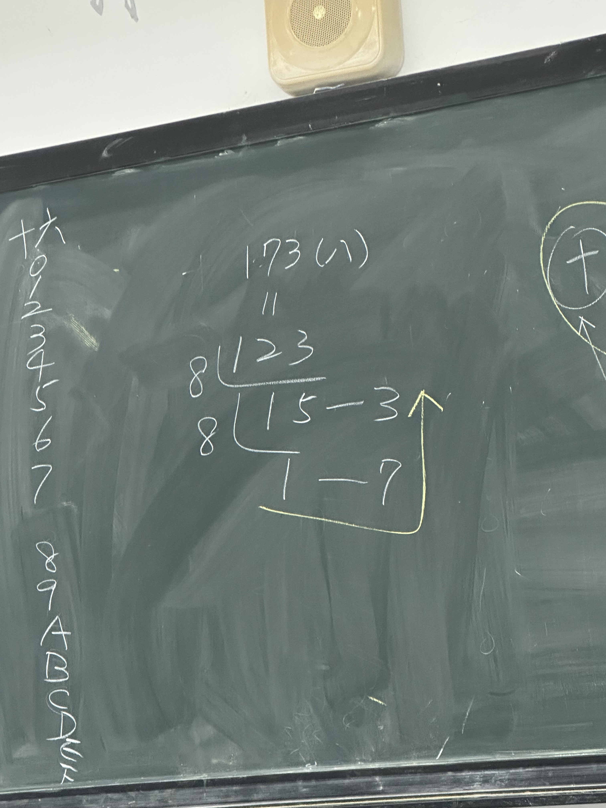

| 10進制 | 2進制  | 8進制 | 16進制 |     |
| ---- | ---- | --- | ---- | --- |
| 0    | 0000 | 0   | 0    |     |
| 1    | 0001 | 1   | 1    |     |
| 2    | 0010 | 2   | 2    |     |
| 3    | 0011 | 3   | 3    |     |
| 4    | 0100 | 4   | 4    |     |
| 5    | 0101 | 5   | 5    |     |
| 6    | 0110 | 6   | 6    |     |
| 7    | 0111 | 7   | 7    |     |
| 8    | 1000 | 10  | 8    |     |
| 9    | 1001 | 11  | 9    |     |
| 10   | 1010 | 12  | A    |     |
| 11   | 1011 | 13  | B    |     |
| 12   | 1100 | 14  | C    |     |
| 13   | 1101 | 15  | D    |     |
| 14   | 1110 | 16  | E    |     |
| 15   | 1111 | 17  | F    |     |

$1234$
$= 1 {\times} 10^3 + 2 {\times} 10^2 + 3 {\times} 10^1 + 4 {\times} 10^0$
$1111011$
$= 1{\times} 2 + 1 {\times} 2^5 + 1 {\times} 2^4 + 1 {\times} 2^3  + 1 {\times} 2^2 + 1 {\times} 2^1 + 1 {\times} 2^0$
$= 64  +32 + 16 + 8 +3 + 1$

173 (八)
$=1 {\times} 8^2 + 7 {\times} 8^1 + 3 {\times} 8^0$
$= 64 + 56 + 3 = 123$

$7B (十六) = 7 {\times} 16^1 + 11 {\times} 16^0$
$11^2 + 11 = 123$

# 小數點

使用算式可以算出 二進制的數字

![[IMG_5300.jpg]]

# 八算式
使用和十進制的算制一樣超過 $8$ 直接 + 1

# idk mini notes?
二進制如果 是 `xxx1` 的話就是單數 (例: 1, 3, 5, 7, 9), 如果是 `xxx0` 的話就是雙數 (例: 2, 4, 6, 8, 0)

八進制不超過 8 (最高 7)

十六進制在十開始後會使用